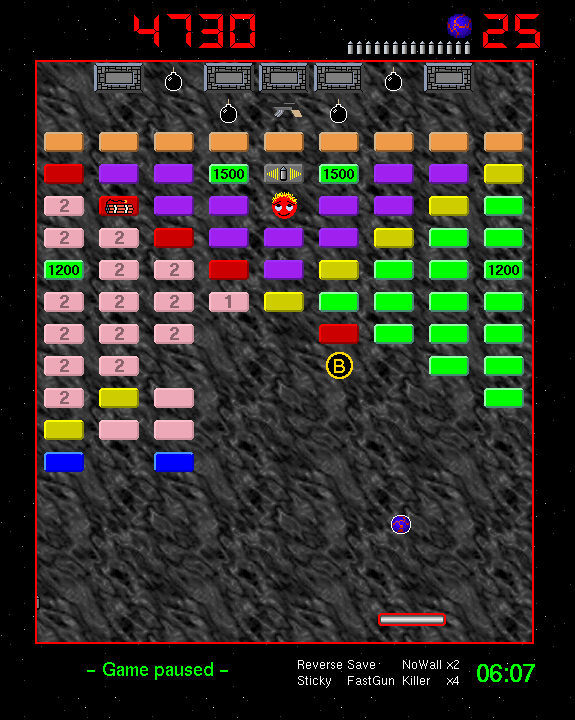
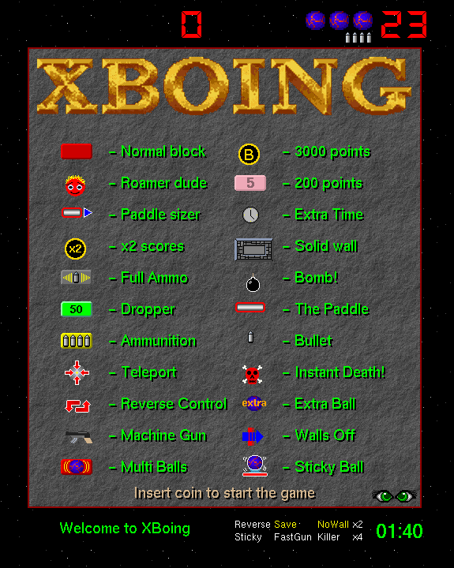
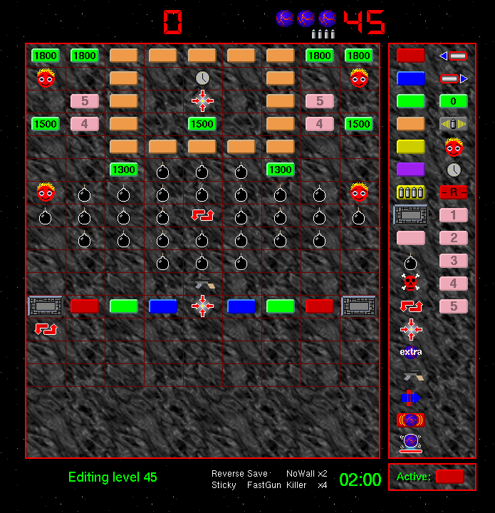
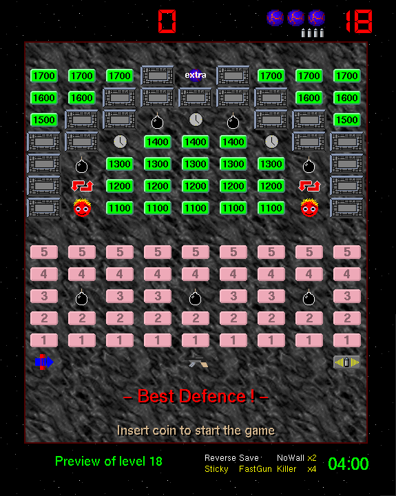

# XBoing

An SDL2 port of XBoing 2.4, the X11 breakout/blockout arcade game written by Justin C. Kibell between 1993 and 1997. All 80 original levels, 30 block types, power-ups, multiball, and the built-in level editor are preserved. Current release: **0.9**.



## Install and play

### macOS / Linux — Homebrew

```bash
brew install jmf-pobox/xboing/xboing
```

If Homebrew asks you to trust the tap first, run `brew trust --formula
jmf-pobox/xboing/xboing` and install again. Add `--HEAD` to build the
latest code from `master` instead of the tagged release.

### Debian / Ubuntu — .deb from source

The Debian package additionally provides a shared, cross-user "machine"
high-score table (setgid `games`, under `/var/games/xboing`), which the
Homebrew build does not — see [docs/DESIGN.md](docs/DESIGN.md) ADR-047.

```bash
sudo apt install build-essential devscripts debhelper cmake \
    libsdl2-dev libsdl2-image-dev libsdl2-mixer-dev libsdl2-ttf-dev libcmocka-dev
dpkg-buildpackage -us -uc -b
sudo dpkg -i ../xboing_*.deb
```

Run the game:

```bash
xboing
```

Basic controls: `Space` launches the ball, `Left` and `Right` move the paddle, the mouse also steers. Full keyboard reference, editor controls, and command-line options:

```bash
man xboing
```

## History

Justin C. Kibell wrote the original XBoing on a SparcStation 2 to learn Xlib. Version 2.4 was released on 22 November 1996 and distributed via `ftp.x.org/contrib/games`. The game uses pure Xlib — no Motif, no Xt — with the XPM library for pixmap graphics, and was published under an X Consortium-style permissive license.

The 1996 sources are preserved verbatim in [`original/`](original/), including Kibell's [original README](original/README) and [copyright notice](original/COPYRIGHT).

  

### Acknowledgements

- **Justin C. Kibell** — original game design, code, and artwork (1993–1997).
- **Arnaud Le Hors** — the XPM library that made Kibell's pixmap-driven graphics possible.
- **Anthony Thyssen** — background imagery.
- All the contributors who sent Kibell bug reports, patches, and platform fixes during the original game's lifetime. See [`original/README`](original/README) for the full credits.

## Modernization

This is an incremental modernization, not a rewrite. The 1996 Xlib sources stay in `original/` as the canonical reference; the new SDL2 implementation lives in `src/` and `include/`. Game behavior — level format, scoring values, physics constants, paddle bounce trigonometry — is preserved. All 80 original levels load and play unchanged.

| Subsystem | Original (1996) | Modernized |
|-----------|-----------------|------------|
| Windowing | Xlib + private colormap + GCs | SDL2 |
| Graphics | XPM via libXpm | PNG via SDL2_image |
| Audio | `fork()` + `/dev/dsp` + 12 platform drivers | SDL2_mixer |
| Sound format | `.au` (Sun audio) | OGG / WAV |
| Build | hand-written `Makefile` + Imake | CMake |
| Paths | compile-time `#define`s | XDG Base Directory spec |
| Fonts | XLFD bitmap fonts | bundled TTF via SDL2_ttf |

**Status**: release 0.9, in the polish phase. All six phases of the [integration roadmap](docs/INTEGRATION_ROADMAP.md) are done; remaining work is tracked in [beads](https://github.com/steveyegge/beads).

For deeper detail:

- [`docs/SPECIFICATION.md`](docs/SPECIFICATION.md) — full technical spec of the original game's 16 subsystems.
- [`docs/MODERNIZATION.md`](docs/MODERNIZATION.md) — from-to architectural changes.
- [`docs/INTEGRATION_ROADMAP.md`](docs/INTEGRATION_ROADMAP.md) — phase-by-phase port plan.
- [`docs/DESIGN.md`](docs/DESIGN.md) — architecture decision records.

## Building and contributing

Development build:

```bash
sudo apt install cmake libsdl2-dev libsdl2-image-dev libsdl2-mixer-dev \
    libsdl2-ttf-dev libcmocka-dev
cmake --preset debug
cmake --build build
ctest --test-dir build --output-on-failure
./build/xboing
```

Sanitizer build — the primary safety net during modernization of a 20-year-old C codebase:

```bash
cmake --preset asan
cmake --build build-asan
ctest --test-dir build-asan --output-on-failure
```

The `Makefile` wraps these: `make build`, `make test`, and `make check` (all CI gates). Run `make help` for the full target list.

### Source layout

| Directory | Contents |
|-----------|----------|
| `src/`, `include/` | Modernized SDL2 implementation: 38 static libraries plus integration glue |
| `tests/` | CMocka unit, integration, fuzz, and replay tests |
| `levels/` | 80 level data files, unchanged from 1996 |
| `sounds/`, `assets/` | Audio assets, fonts, and converted PNG sprites |
| `original/` | 1996 Xlib sources, preserved as reference |
| `docs/` | Specification, modernization plan, design decisions |
| `debian/`, `packaging/` | Debian packaging, `.desktop` file, AppStream metainfo, icons |

Read [`CLAUDE.md`](CLAUDE.md) for development principles, quality gates, and commit conventions; [`AGENTS.md`](AGENTS.md) covers the `bd` issue-tracking workflow.

## License

- **Modernization** (everything outside `original/`): [MIT](LICENSE), © 2025–2026 J Freeman (jmf-pobox).
- **Original 1993–1997 sources** (`original/`): X Consortium-style permissive license, © Justin C. Kibell. Preserved verbatim in [`original/COPYRIGHT`](original/COPYRIGHT).
